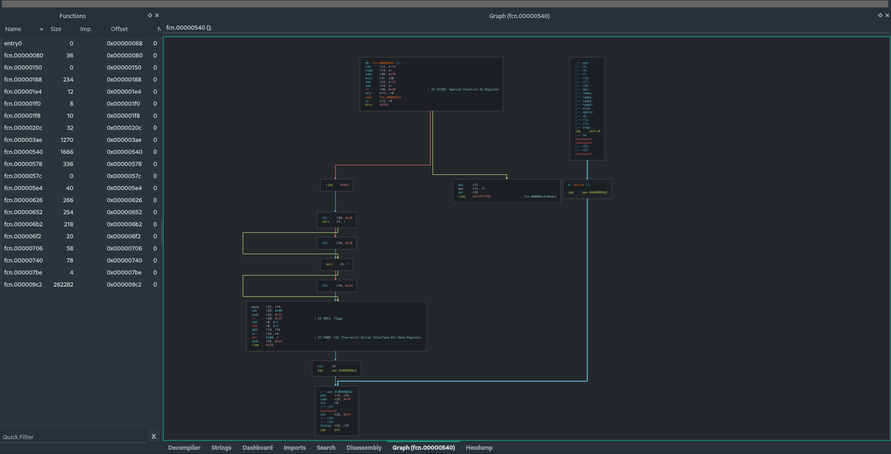

# hex2raw

This little and useful tool parses firmwares code in .hex format into a dump and readable format for futures manipulation.


## Why ?

When you compile a firmware for some microcontrollers, like AVR board or Arduino (Which is also an AVR), a .hex file with the code in string format will be generated for softwares like [avrdude](https://www.nongnu.org/avrdude/) be able to read and flash correctly in the board.

## .hex example

```
:100000000C9434000C9451000C9451000C94510049
:100010000C9451000C9451000C9451000C9451001C
:100020000C9451000C9451000C9451000C9451000C
:100030000C9451000C9451000C9451000C945100FC
:100040000C9451000C9451000C9451000C945100EC
:100050000C9451000C9451000C9451000C945100DC
```

This is a piece of an .hex file that will be flashed inside an ATMEGA328p (AKA Arduino), you can use this tool to convert this .hex back to his blob representation.

```sh
$ python3 hex_to_asm.py matrix.hex --board atmega328p
Parsing matrix.hex
Written as matrix.hex.dump
```
With this dumped file you can use in your favorite binary analysis tool, take a look in the radare2 output.

```
~/.../python/hex_to_asm >>> rabin2 -I matrix.hex.dump                                                                                                                                                      
arch     avr
baddr    0xffffffffffffffff
binsz    2636
bits     8
canary   false
retguard false
crypto   false
endian   little
havecode true
laddr    0x0
linenum  false
lsyms    false
machine  ATmel
maxopsz  16
minopsz  1
nx       false
os       avr
pcalign  0
pic      false
relocs   false
sanitiz  false
static   true
stripped false
va       false
```

#### Going further

Loading with [Cutter](https://github.com/radareorg/cutter):




# Expanding this

You can help expading this tool parsing capabilites by adding new entries in the ***prefix_address_size.yml*** file, this tool loads that config files to know where the addressing starts and ends.

####  Example: ATMEGA328P

The address size of an atmega328p has an 32k memory addressing/size, so the first 8 digits is the address part (10004000 for example) and we have the ":" mark that indicate that a new line started, so we need supply to our configuration file a address size of  ***9***.

```yaml
boards:
    atmega328p: 9 #:<address>
```

You can help this project by adding news entries in this file and creating a pull request for each one :)


## TODO

- [ ] Convert dump files into a .hex files 

Thanks!


